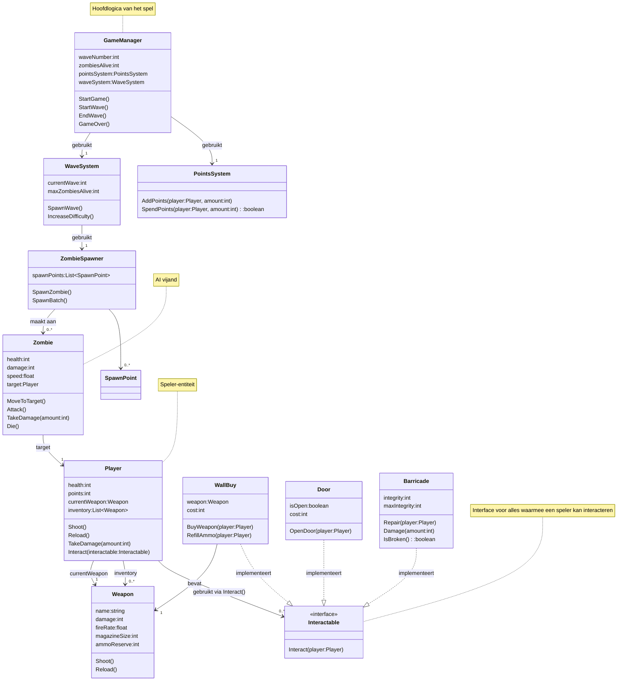
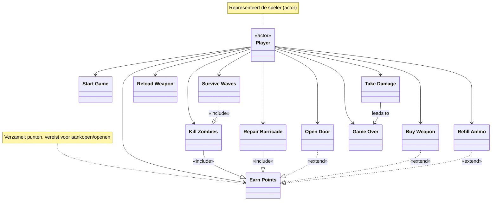

# diagrammen

## class diagram

```mermaid
classDiagram
    %% Hoofdsystemen
    class GameManager {
        waveNumber:int
        zombiesAlive:int
        pointsSystem:PointsSystem
        waveSystem:WaveSystem
        StartGame()
        StartWave()
        EndWave()
        GameOver()
    }
    class WaveSystem {
        currentWave:int
        maxZombiesAlive:int
        SpawnWave()
        IncreaseDifficulty()
    }
    class ZombieSpawner {
        spawnPoints:List~SpawnPoint~
        SpawnZombie()
        SpawnBatch()
    }
    class PointsSystem {
        AddPoints(player:Player, amount:int)
        SpendPoints(player:Player, amount:int):boolean
    }
    %% Zombie en Spawning
    class Zombie {
        health:int
        damage:int
        speed:float
        target:Player
        MoveToTarget()
        Attack()
        TakeDamage(amount:int)
        Die()
    }
    %% Speler en wapens
    class Player {
        health:int
        points:int
        currentWeapon:Weapon
        inventory:List~Weapon~
        Shoot()
        Reload()
        TakeDamage(amount:int)
        Interact(interactable:Interactable)
    }
    class Weapon {
        name:string
        damage:int
        fireRate:float
        magazineSize:int
        ammoReserve:int
        Shoot()
        Reload()
    }
    %% Interactables
    class Interactable {
        <<interface>>
        Interact(player:Player)
    }
    class WallBuy {
        weapon:Weapon
        cost:int
        BuyWeapon(player:Player)
        RefillAmmo(player:Player)
    }
    class Door {
        isOpen:boolean
        cost:int
        OpenDoor(player:Player)
    }
    class Barricade {
        integrity:int
        maxIntegrity:int
        Repair(player:Player)
        Damage(amount:int)
        IsBroken():boolean
    }

    %% Relaties
    GameManager --> "1" WaveSystem : gebruikt
    GameManager --> "1" PointsSystem : gebruikt
    WaveSystem --> "1" ZombieSpawner : gebruikt
    ZombieSpawner --> "0..*" Zombie : maakt aan
    Zombie --> "1" Player : target

    Player --> "1" Weapon : currentWeapon
    Player --> "0..*" Weapon : inventory

    WallBuy --> "1" Weapon : bevat

    Player --> "0..*" Interactable : gebruikt via Interact()

    WallBuy ..|> Interactable : implementeert
    Door ..|> Interactable : implementeert
    Barricade ..|> Interactable : implementeert

    %% Multipliciteit voor spawners
    ZombieSpawner --> "0..*" SpawnPoint

    %% Extra labels (optioneel, voor duidelijkheid)
    %% class SpawnPoint

    %% Annotations voor clarity
    note for Interactable "Interface voor alles waarmee een speler kan interacteren"
    note for GameManager "Hoofdlogica van het spel"
    note for Zombie "AI vijand"
    note for Player "Speler-entiteit"
```

## use-case diagram

```mermaid
classDiagram
    %% Actor
    class Player
    <<actor>> Player

    %% Use Cases
    class `Start Game`
    class `Survive Waves`
    class `Kill Zombies`
    class `Earn Points`
    class `Open Door`
    class `Repair Barricade`
    class `Buy Weapon`
    class `Refill Ammo`
    class `Reload Weapon`
    class `Take Damage`
    class `Game Over`

    %% Player interacts with all use cases
    Player --> `Start Game`
    Player --> `Survive Waves`
    Player --> `Kill Zombies`
    Player --> `Earn Points`
    Player --> `Open Door`
    Player --> `Repair Barricade`
    Player --> `Buy Weapon`
    Player --> `Refill Ammo`
    Player --> `Reload Weapon`
    Player --> `Take Damage`
    Player --> `Game Over`

    %% Relationships (include & extend & normal flows)
    `Survive Waves` --|> `Kill Zombies` : «include»
    `Kill Zombies` --|> `Earn Points` : «include»
    `Repair Barricade` --|> `Earn Points` : «include»

    `Open Door` ..|> `Earn Points` : «extend»
    `Buy Weapon` ..|> `Earn Points` : «extend»
    `Refill Ammo` ..|> `Earn Points` : «extend»

    `Take Damage` --> `Game Over` : leads to

    %% Extra logic: Repair earns points, buy/open/refill require points

    %% Optional: notes for clarity
    note for Player "Representeert de speler (actor)"
    note for `Earn Points` "Verzamelt punten, vereist voor aankopen/openen"
```